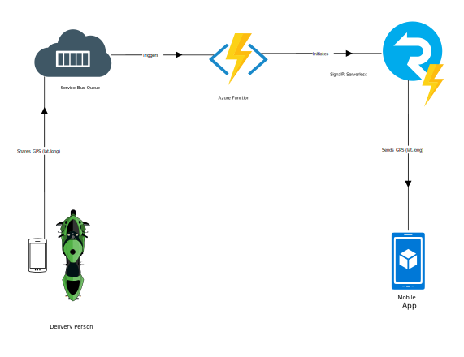

# Sharing location in real time using low cost serverless Azure services

Ever wondered how you receive location of your Uber without the whole page refreshing? How you are able to track your food delivery guy in real time? How social media services are able to send you notifications without a browser refresh? Real time messaging services. That's how!

In this example, I look at how we can set up a real time messaging service to share live location of a food delivery guy on his way to deliver to you a fresh pizza. This example can also be useful for users trying to build a real time location sharing platform for their web or mobile applications.

Azure allows you to go server-less and only pay for what you use. So if your clients have budget issues and cannot afford servers for hosting your messaging service backend, this example is for you!

I will be using a SignalR service configured in server-less mode to integrate with an Azure Functions app triggered by a Service Bus. All of it using .NET Core

## Potential use cases

These other uses cases have similar design patterns:

* Sharing real time location with client devices.
* Pushing notifications to users.
* Updating timelines.
* Create chat rooms.

## Architecture

### Components

* [Service Bus](https://azure.microsoft.com/en-us/services/service-bus/), a highly-reliable cloud messaging service between applications and services, even when one or more is offline. Available in every Azure region, this fully-managed service eliminates the burdens of server management and licensing. 
* [SignalR](https://azure.microsoft.com/en-us/services/signalr-service/), makes it easy to add real-time communications to your web application. It is as simple as provisioning a service—no need to be a real-time communications guru!
* [Azure Functions](https://azure.microsoft.com/en-in/services/functions/), an event-driven serverless compute platform that can also solve complex orchestration problems. Build and debug locally without additional setup, deploy and operate at scale in the cloud and integrate services using triggers and bindings.

### Alternatives

In the past, I have worked on a similar example with [Pusher](https://pusher.com/). It is the category leader in robust APIs for app developers building scalable realtime communication features. 

There is also [PubNub](https://pubnub.com/). PubNub makes it easy for you to add real-time capabilities to your apps, without worrying about the infrastructure. Build apps that allow your users to engage in real-time across mobile, browser, desktop and server.

No doubt that Pusher and PubNub are the widely adopted platforms for real-time messaging but I wanted to do everything in Azure using just Azure services. SignalR was simply the go to for me as it allows bi-directional communication between server and client. It is also an open source tool with 7.9K GitHub stars and 2.2K GitHub forks. 

[Here's](https://github.com/SignalR/SignalR) a link to SignalR's open source repository on GitHub.

## Considerations

When I set out to build this usecase combining three different services together to achieve this scenario, I could not find existing code samples, tutorials or extensive documentation. I had to figure out how to parameter the Azure Service Bus connection string in the ServiceBusTrigger. 

There is also little documentation on the difference between Hubs and Targets. 

**Hubs:** Hubs can be compared to a streaming service like Netflix, Hulu etc. You can subscribe to the Hub to send/receive messages from/to the Hub.

**Targets:** Targets are like radio channels. Everyone who is listening to the Target channel and is notified when there is a new message on it. 

If you can remember the above to features of SignalR platform, you will face no difficulties setting it up. 

### Availability, Scalability, and Security

> How do I need to think about managing, maintaining, and monitoring this long term?

> Are there any size considerations around this specific solution?
> What scale does this work at?
> At what point do things break or not make sense for this architecture?

> Are there any security considerations (past the typical) that I should know about this?

## Deploy this scenario

### Azure Functions development
A serverless real-time application built with Azure Functions and Azure SignalR Service typically requires two Azure Functions:

* A "negotiate" function that the client calls to obtain a valid SignalR Service access token and service endpoint URL
* One or more functions that send messages or manage group membership

### FunctionApp6
Deliberately named function app 6 because it was my sixth attempt trying to create a Azure Function with Service Bus trigger that'd work with SignalR. 

#### Negotiate.cs
This function is triggered by a Http request. It is used by client applications to get a token from the SignalR service which clients can use to subscribe to a hub. This should always be named negotiate. For more information [read this guide](https://docs.microsoft.com/en-us/azure/azure-signalr/signalr-concept-serverless-development-config)

#### Message.cs
This function is triggered by a Service Bus Trigger. It has a binding with SignalR service. It pulls the message from the queue and passes it on to a SignalR hub. 

#### Instructions
1. Make sure you have a Service Bus Queue provisioned on Azure.
2. Make sure you have a SignalR service provisioned in serverless mode on Azure.
3. Enter your connection strings (Service Bus & SignalR) in the **local.settings.json file.**
4. Enter the URL of client application (SignalR client) in CORS. Honestly, this was a huge pain to figure out as most blogs have outdated syntax of enabling CORS. [This guide](https://docs.microsoft.com/en-us/azure/azure-signalr/signalr-concept-serverless-development-config) provided the updated syntax.
5. Enter your Service Bus Queue name in the Service Bus Trigger inside **Message.cs file**.

You are all set. Let's configure the client application to test. 

### SignalR Client
This a simple .NET Core web application to subscribe to the hub created by FunctionApp6 and display messages received on the Service Bus Queue in real time. Although you can use FunctionApp6 to work with a mobile client but for the purpose of this repository, I'll stick to the web client. 

#### Instructions
1. Make sure FunctionApp6 is running first.
2. Copy the url generated by the Negotiate function. It will look something like this: http://localhost:7071/api/
3. Paste the url into chat.js inside signalR.HubConnectionBuilder().withUrl("YOUR_URL_HERE").build();
4. Run the application.
5. You'll see status connected when the web client successfully subscribes to the SignalR hub. 

### SendToQueue.js
This is a node js script to push a message to the Service Bus so that you can test the deployment you did above. 

#### Instructions
1. Install the node Azure Service Bus module (@azure/service-bus). 
2. Enter your connection strings and queue name in the script.
3. Run the script. 

## Next Steps

You can take this scenario right into your production environment. However, make sure your Azure services are set to scale. For instance, your Azure Service Bus should be set to a standard or premium plan.

You can deploy the code to Azure Functions right from Visual Studio. [Follow this guide](https://tutorials.visualstudio.com/first-azure-function/publish) to know how to publish your code to Azure Functions from Visual Studio. 

## Related Resources

[This article explains](https://docs.microsoft.com/en-us/azure/azure-functions/functions-bindings-service-bus) how to work with Azure Service Bus bindings in Azure Functions. Azure Functions supports trigger and output bindings for Service Bus queues and topics.

[This article explains](https://docs.microsoft.com/en-us/azure/azure-functions/functions-bindings-signalr-service) how to authenticate and send real-time messages to clients connected to Azure SignalR Service by using SignalR Service bindings in Azure Functions. Azure Functions supports input and output bindings for SignalR Service.

<!-- links -->
[calculator]: https://azure.com/e/
[availability]: /azure/architecture/checklist/availability
[resource-groups]: /azure/azure-resource-manager/resource-group-overview
[resiliency]: /azure/architecture/resiliency/
[security]: /azure/security/
[scalability]: /azure/architecture/checklist/scalability
